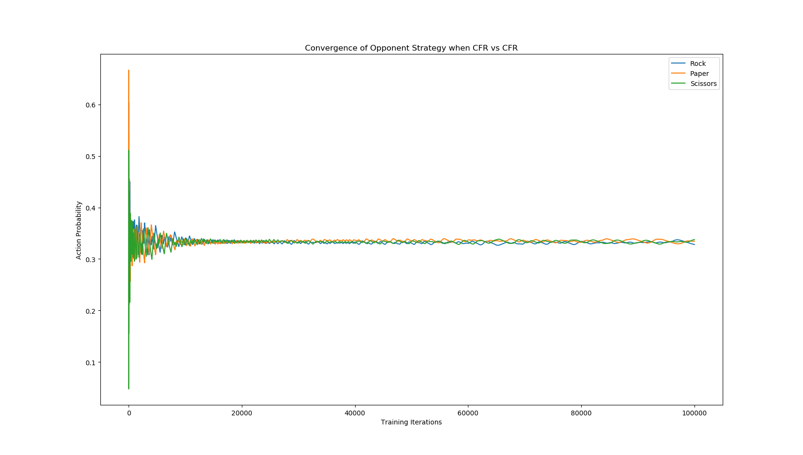

# Exploring Counterfactual Regret Minimization for Small Imperfect Information Games

## Summary

Per my project proposal, I intended to tackle three games covered in ["An Introduction to Counterfactual Regret Minimization"](http://example.com "Paper Reference"): Kuhn Poker, Dudo, and Liar Die.  I swapped Dudo out for Rock-Paper-Scissors (RPS). I felt like working through RPS would benefit my own learning and allow me to explore the broadest depth of techniques within CFR (Both Kuhn Poker and Dudo use the same algorithm).  I use RPS to look at the foundation of CFR in the context of a One-Shot-Game.  Kuhn Poker demonstrates how CFR concepts are extrapolated to sequential games.  Liar Die demonstrates how dynamic programming can improve CFR algorithms.

## Rock Paper Scissors
### Rules
I probably don't need to rehash what rock paper scissors entails
### Approach
### Results

## Kuhn Poker
### Rules
### Approach
### Results
## Liar Die
### Rules
### Approach
### Results
## Conclusion
