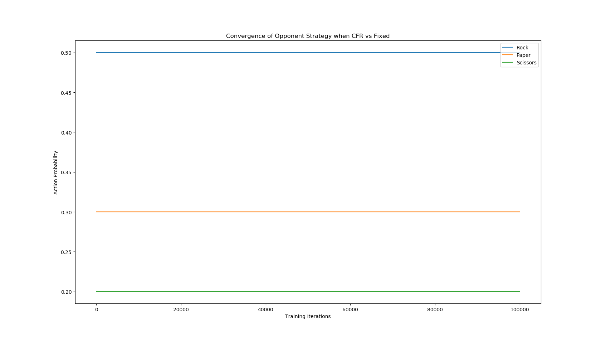

# Exploring Counterfactual Regret Minimization for Small Imperfect Information Games

## Summary

Per my project proposal, I intended to tackle three games covered in ["An Introduction to Counterfactual Regret Minimization"](http://modelai.gettysburg.edu/2013/cfr/cfr.pdf "Paper Reference"): Kuhn Poker, Dudo, and Liar Die.  I swapped Dudo out for Rock-Paper-Scissors (RPS). I felt like working through RPS would benefit my own learning and allow me to explore the broadest depth of techniques within CFR (Both Kuhn Poker and Dudo use the same algorithm).  I use RPS to look at the foundation of CFR in the context of a one-shot game.  Kuhn Poker demonstrates how CFR concepts are extrapolated to sequential games.  Liar Die demonstrates how dynamic programming can improve CFR algorithms.

## Rock Paper Scissors
### Rules
I probably don't need to rehash what rock paper scissors entails but I will do so to explain some fundamental game theory concepts. Each games has
* N = {1,...,n} a finite set of players
* Si = a finite set of actions for player i
* A = S1 X ... X Sn set of all possible cobinations of simultaneous actions (action profile)
* u is a map from an action profile to a vector of utilities for each player
 
I mentioned above that RPS is considered a one-shot game.  This is because each player makes a single decision and the game reaches a terminal state.  This makes RPS and equivalently complex games a great playgroud for exploring CFR ideas.
### Approach
### Results

## Kuhn Poker
### Rules
### Approach
### Results
## Liar Die
### Rules
### Approach
### Results

## Conclusion
The current form of my code is much less modular than I was expecting.  Much of the structure of my CFR algorithm is tied down 
